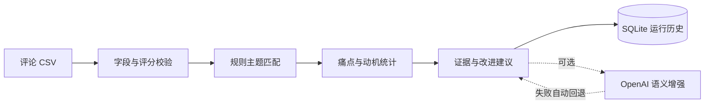

<p align="center"></p>

<h1 align="center">Review Insight Agent</h1>
<p align="center"><strong>Evidence before opinion. Signals before summaries.</strong></p>
<p align="center">
  <a href="https://github.com/JimMinseay3/crossborder-review-insight-agent/actions/workflows/ci.yml"></a>
  
  
  
</p>
<p align="center"><a href="#快速开始">快速开始</a> · <a href="#输入格式">数据契约</a> · <a href="#api">API</a> · <a href="#已知边界">边界</a></p>

评论洞察 Agent 是一个面向跨境电商卖家的本地可运行原型。它读取 Amazon 风格的评论 CSV，使用确定性规则提取主题、痛点、正向购买动机和代表性证据，并把结果保存为可审计的运行记录。

默认 `mock` 模式完全离线，无需 API Key；也可以通过 OpenAI Responses API 增加语义摘要。模型失败不会影响基础统计和规则结果。

| 项目状态 | 工程信号 | 决策安全 |
|---|---|---|
| **可运行 MVP** | CI、测试、SQLite 审计记录 | 小样本与未知主题自动转人工 |

## 能做什么

- 校验评论字段、评分范围和异常行。
- 统计评分分布与平均评分。
- 识别电池、舒适度、质量、音质、物流和价值感等主题。
- 区分低评分痛点与高评分购买动机。
- 为每个洞察保留评论 ID、评分和原文片段。
- 生成产品改进优先级与可用于 Listing 的卖点方向。
- 保存步骤、证据、警告、置信度和人工复核原因。

## 工作流



## 快速开始

```powershell
git clone https://github.com/JimMinseay3/crossborder-review-insight-agent.git
cd crossborder-review-insight-agent
python -m venv .venv
.\.venv\Scripts\Activate.ps1
python -m pip install -r requirements.txt
python -m uvicorn app.main:app --reload --port 8101
```

打开 [http://127.0.0.1:8101](http://127.0.0.1:8101)，选择内置样例 `reviews.csv` 后运行。macOS / Linux 激活虚拟环境时使用 `source .venv/bin/activate`。

## 输入格式

CSV 必须包含以下列：

| 字段 | 含义 | 示例 |
|---|---|---|
| `review_id` | 评论唯一标识 | `R001` |
| `rating` | 1–5 星评分 | `5` |
| `title` | 评论标题 | `Comfortable fit` |
| `body` | 评论正文 | `Very comfortable for long calls` |
| `country` | 市场或国家 | `US` |
| `date` | 评论日期 | `2026-06-01` |
| `verified` | 是否已验证购买 | `true` |

单次上传限制为 2 MB。无效评分行会被跳过并记录警告；缺少必需列时请求会返回 `422`。

## 输出内容

```json
{
  "review_count": 12,
  "average_rating": 3.33,
  "rating_distribution": {"1": 2, "2": 2, "3": 2, "4": 2, "5": 4},
  "themes": [],
  "priority_improvements": [],
  "listing_angles": []
}
```

每个主题还会包含提及次数、痛点次数、正向次数和最多两条代表性证据。

## API

| 方法 | 路径 | 用途 |
|---|---|---|
| `GET` | `/` | 中文操作界面 |
| `GET` | `/health` | 健康状态与模型提供者 |
| `GET` | `/api/examples` | 内置样例 |
| `POST` | `/api/runs` | 创建分析任务 |
| `GET` | `/api/runs` | 查询历史记录 |
| `GET` | `/api/runs/{run_id}` | 查询运行详情 |
| `GET` | `/api/runs/{run_id}/export` | 下载完整 JSON |

```bash
curl -X POST http://127.0.0.1:8101/api/runs \
  -H "Content-Type: application/json" \
  -d '{"example":"reviews.csv"}'
```

## 配置

复制 `.env.example` 为 `.env`：

```env
MODEL_PROVIDER=mock
OPENAI_API_KEY=
OPENAI_MODEL=
DATABASE_PATH=.data/agent.db
```

`MODEL_PROVIDER=openai` 时必须显式配置 API Key 与模型名。模型只增加摘要和行动建议，不改写确定性统计事实。

## 项目结构

```text
app/         FastAPI、领域工作流、模型适配器和 SQLite 存储
templates/   中文操作页面
static/      页面样式
samples/     合成评论数据
tests/       API、业务规则、存储与模型回退测试
```

## 测试

```powershell
python -m pytest -q
```

测试覆盖健康检查、页面加载、样例分析、SQLite 持久化、JSON 导出、非法扩展名，以及 OpenAI 缺少配置、超时和无效 JSON 时的自动回退。

## 已知边界

- 主题分类是可解释的关键词基线，不等于完整的语义聚类模型。
- 小样本和未归类评论会触发人工复核提示。
- 本项目不会抓取 Amazon 数据；请上传有权使用的数据。
- 输出用于产品与运营研究，不应作为无证据宣传的依据。

## Roadmap

- 多语言语义主题合并与情感强度分析。
- ASIN、时间段和国家维度对比。
- 退货原因与评论主题联合分析。
- 可配置分类字典与人工标注反馈闭环。

## Project

- [Changelog](CHANGELOG.md)
- [Contributing guide](CONTRIBUTING.md)
- [MIT License](LICENSE)

## License

[MIT](LICENSE) © 2026 JimMinseay3
